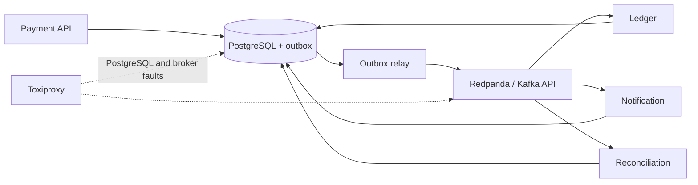

# Event Driven Payments Reliability Lab

Портфельный QA-стенд, который доказывает поведение event-driven платёжного контура при duplicates, redelivery, out-of-order delivery, retry/DLQ и сетевых сбоях. В наборе 96 автоматизированных pytest/Pact кейсов, Testcontainers, Toxiproxy и чистый Compose smoke.

Это lab, а не production-платёжная система: он не обрабатывает реальные деньги и не заявляет PCI DSS compliance или production reliability.

## Контур

`Payment API → PostgreSQL transactional outbox → Redpanda → ledger / notification / reconciliation consumers → PostgreSQL`



Суммы хранятся только как целые minor units. Notification фиксирует намерение доставки, но не вызывает внешний сервис.

## Быстрый запуск

```bash
docker compose up -d --build --wait
curl -X POST http://localhost:8000/payments \
  -H 'Content-Type: application/json' \
  -H 'Idempotency-Key: demo-1' \
  -d '{"amount_minor":1250,"currency":"RUB"}'
# Используйте payment_id из ответа:
curl -X POST http://localhost:8000/payments/<payment_id>/authorize \
  -H 'Idempotency-Key: demo-authorize-1'
docker compose down -v
```

API: `GET /health/live`, `GET /health/ready`, `POST /payments`, `POST /payments/{payment_id}/authorize`, `GET /payments/{payment_id}`. Заголовок `Idempotency-Key` обязателен для обеих команд. Relay и каждый consumer также публикуют внутренние `/health/live` и `/health/ready` на порту `8081`.

Consumers сначала устойчиво сохраняют события в PostgreSQL inbox, затем применяют их по `aggregate_version`. После трёх неуспешных попыток событие через надёжный DLQ-outbox публикуется в consumer-specific DLQ topic.

## Fault injection

Runtime-процессы подключаются к PostgreSQL и Redpanda через Toxiproxy. Доступны воспроизводимые профили `postgres-latency`, `postgres-timeout`, `postgres-reset`, `postgres-disconnect`, `broker-latency`, `broker-timeout`, `broker-reset`, `broker-disconnect` и `broker-bandwidth`:

```bash
TOXIPROXY_URL=http://localhost:8474 .venv/bin/python -m payments_lab.faults apply broker-disconnect
TOXIPROXY_URL=http://localhost:8474 .venv/bin/python -m payments_lab.faults reset
```

После ручного сценария всегда выполняйте `reset`. Остановка `docker compose down -v` также удаляет тестовые volumes.

## Тесты

Основные тесты работают на Python 3.9+, но актуальный Pact V4 SDK требует Python 3.10+. На машине с Python 3.9 Pact tests можно воспроизвести в контейнере:

```bash
python3 -m venv .venv
.venv/bin/python -m pip install --upgrade pip
.venv/bin/pip install -e '.[test]'
.venv/bin/python scripts/check_test_count.py
.venv/bin/pytest
docker run --rm -e PACT_DO_NOT_TRACK=1 -v "$PWD:/app" -w /app python:3.12-slim \
  sh -c "pip install -q -e '.[test]' && pytest tests/test_contracts.py -q"
```

Pytest поднимает изолированные PostgreSQL и Redpanda через Testcontainers. Локальные Pact V4 contracts находятся в `pacts/`; внешний Pact Broker не используется.

Полная локальная проверка с coverage: `make verify`. Compose-сценарий: `make compose-up`, `make smoke`, затем обязательно `make compose-down`. GitHub Actions выполняет тесты и Compose smoke в раздельных jobs, сохраняя JUnit, coverage, Pact и failure logs.

Документация: [test strategy](TEST_STRATEGY.md), [evidence](EVIDENCE.md), [defect playbooks](docs/defect-playbooks/), [specification](SPEC.md), [decisions](DECISIONS.md).
