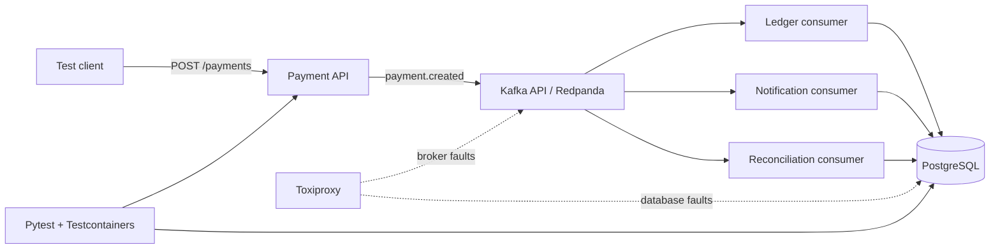

# Specification

## Scope

Лабораторный стенд моделирует приём платёжной команды, публикацию события и независимую обработку ledger, notification и reconciliation consumers. Все суммы — целые minor units; реальные деньги и платёжные реквизиты вне scope.

## Event flow

Payment API и outbox используют одну PostgreSQL-транзакцию. Relay публикует `payment.created` в topic `payments.events.v1`; три независимые consumer groups строят projections. Reconciliation допускает промежуточный `pending`, если событие пришло до ledger projection, и завершается после появления ledger entry.

## Event envelope

Событие содержит `event_id`, `event_type`, `schema_version`, `payment_id`, `aggregate_version`, `amount_minor`, `currency`, `correlation_id`, nullable `causation_id` и `occurred_at`. Kafka message key — `payment_id`.

Поддерживаемый lifecycle: `payment.created` с aggregate version 1 и `payment.authorized` с version 2. Consumers сохраняют delivery в PostgreSQL inbox до commit Kafka offset и применяют события только без разрыва версий. После трёх transient failures событие направляется через DLQ-outbox в topic конкретного consumer. Неизвестный event type или schema version считается non-retryable.

## Invariants

1. `payment_id` уникален; повтор команды с тем же ключом не создаёт второе списание.
2. `amount_minor` — положительное целое число в диапазоне PostgreSQL `BIGINT`, `currency` — три заглавные ASCII-буквы.
3. Одно принятое платежное событие создаёт не более одной ledger entry на `payment_id`.
4. Повторная доставка одного `event_id` не меняет итоговый ledger повторно.
5. Порядок событий определяется бизнес-версией aggregate, а не временем доставки.
6. Consumer offset подтверждается только после устойчивой фиксации результата обработки.
7. Частичный сбой consumer не отменяет уже принятую команду; система сходится после retry.
8. Reconciliation сравнивает источник истины payment с ledger и явно фиксирует расхождения.
9. Notification не является условием финансовой корректности.
10. Состояние считается согласованным eventual: все обязательные projections достигают версии платежа в ограниченное тестом время.
11. Любая сумма сохраняется и сравнивается без `float`.
12. Correlation/causation IDs позволяют связать команду, событие и результаты consumers.

## Test architecture target

- Pytest управляет сценарием и проверяет API, события и PostgreSQL.
- Testcontainers поднимает изолированные PostgreSQL, Redpanda и Toxiproxy.
- Pact V4 локально проверяет требования трёх consumers и фактический producer serializer.
- Pact фиксирует contracts producer/consumer.
- Toxiproxy создаёт таймауты, разрывы и деградацию сети.
- API, relay и consumers ходят к зависимостям через два независимых proxy; migrations и topic initialization используют прямой путь.
- Docker Compose даёт ручной воспроизводимый стенд.
- Набор тестов покрывает happy path, duplicates, redelivery, out-of-order, timeout, disconnect и partial failure; каждый тест привязан к риску.
- GitHub Actions запускает Python 3.12 tests/coverage и чистый Compose lifecycle/fault smoke в раздельных jobs.

## Acceptance criteria

Финальная версия содержит 96 содержательных pytest/Pact cases, CI, воспроизводимые defect scenarios и доказательства отсутствия двойного списания и корректной reconciliation.
